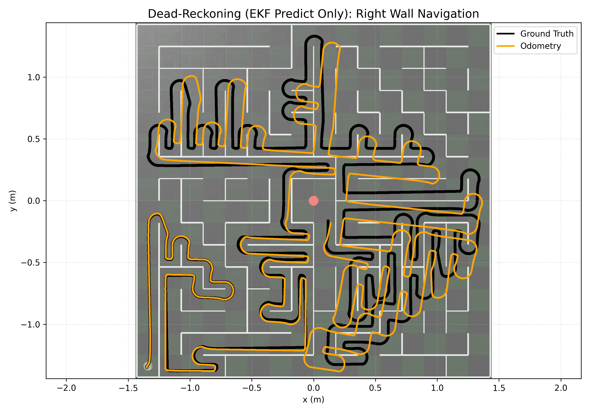
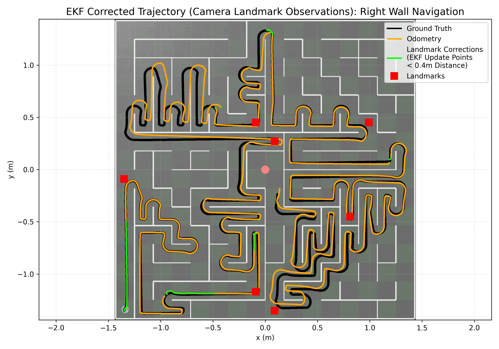

# Webots E-Puck Extended Kalman Filter (EKF) Implementation

This project demonstrates a simple wall-hugging algorithm for the E-Puck robot in Webots, with odometry correction through camera-based landmark observations using an Extended Kalman Filter (EKF). Calibration scripts are provided for the lidar, IR proximity sensors, and camera module.

Results show reduced positional drift compared to dead-reckoning odometry.

Without EKF (raw odometry):

```
Errors produced between ground truth labels and predicted x and y:
        Mean Euclidean error: 0.0904 (3 sf)
        Root mean squared error: 0.11 (3 sf)
```

With EKF (landmark corrections):

```
Errors produced between ground truth labels and predicted x and y:
        Mean Euclidean error: 0.0247 (3 sf)
        Root mean squared error: 0.0341 (3 sf)
```

After EKF correction, navigation from start to maze completion using right-wall hugging reduced the mean Euclidean error by 0.0657 and RMSE by 0.0759 for the tested landmark configurations (see `/worlds/maze_uk2015f.wbt`).




